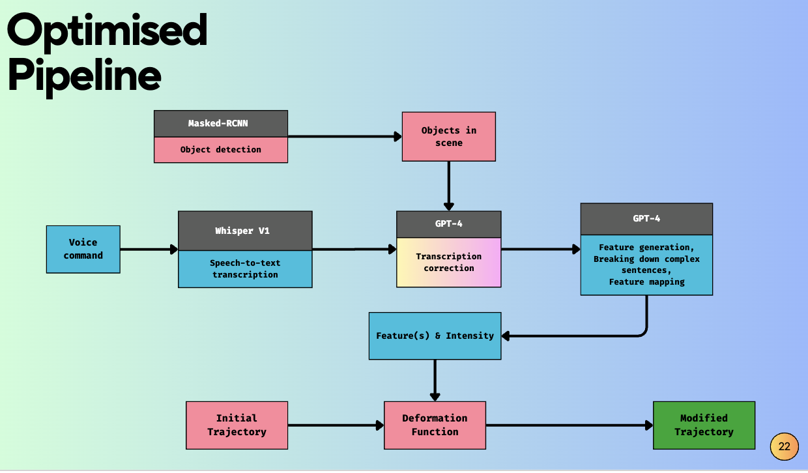

# Extract-Language-Intent #

Final Year Project Under Faculty of MAE of Nanyang Technological University.

## Project Description ##

This project focuses on extracting human intent from vocal commands, processing the information, and translating it into a deformation function to adjust the trajectory of a robotic arm

## Dependencies ##

- Ensure you have Anaconda installed on your system
- You can also use .venv to create a virtual environment
- Run the following commands (skip the first command if you are using .venv)

```
conda create -n <env_name> python=3.11
pip install -r requirements.txt
```

## Run pipeline ##

- Run `main.py` to run the entire pipeline (from transcription to processing and outputting feature output).

- Refer to the `if __name__ == '__main__':` section in `main.py` to understand the pipeline to adjust whether you want to start by transcribing an already recorded audio files or use the microphone to record audio.

- Pipeline does not maintain audio database. New audio will keep piling up in the audio folder.

## Benchmark ##

### Details ###

- Benchmark only test for the processing steps by the language model

- Refer to Whisper folder to understand the entire pipeline

- `run_chat.py` to benchmark gpt-4 model our dataset

- `run_embeddings.py` to benchmark ada-002 and text-embedding-3-large models on our datasets

- `config.yaml` file in the config folder contains paths for datasets, output and etc 

- <:Refer to the pdfs to understand why we are trying two different model types>

### How to Run ###

1. Ensure you are the same directory as the `run_chat.py` or `run_embeddings.py` file

2.  Run the following command in the terminal (chat model)

    ```
    python run_chat.py --model <model_name> --batch <batch_number>
    ```

    where `model_name` = 'gpt-4' or 'gpt-4-turbo-preview'
    and `batch_number` = 1, 2, 3, 4, 5 

    - batch 1 = (1-20)
    - batch 2 = (21-40)
    - batch 3 = (41-60)
    - batch 4 = (61-80)
    - batch 5 = (81-100)

3.  Run the following command in the terminal (embedding model)

    ```
    python run_embedding.py --batch <batch_number>
    ```

    where `model_name` = 
    and `batch_number` = 1, 2, 3, 4, 5 

    - batch 1 = (1-20)
    - batch 2 = (21-40)
    - batch 3 = (41-60)
    - batch 4 = (61-80)
    - batch 5 = (81-100)

## Overall Pipeline ##



- This repo only consists of the Language segment of the pipeline (blue boxes + transcription correction)

- Red boxes are from another repositories

## Result ##

- Refer to pdfs