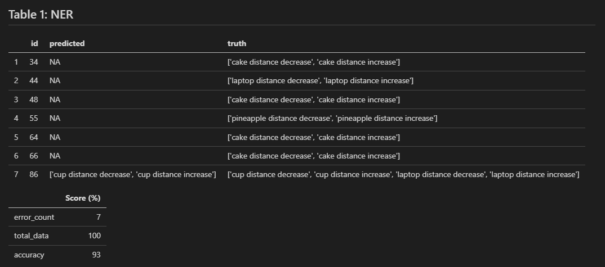
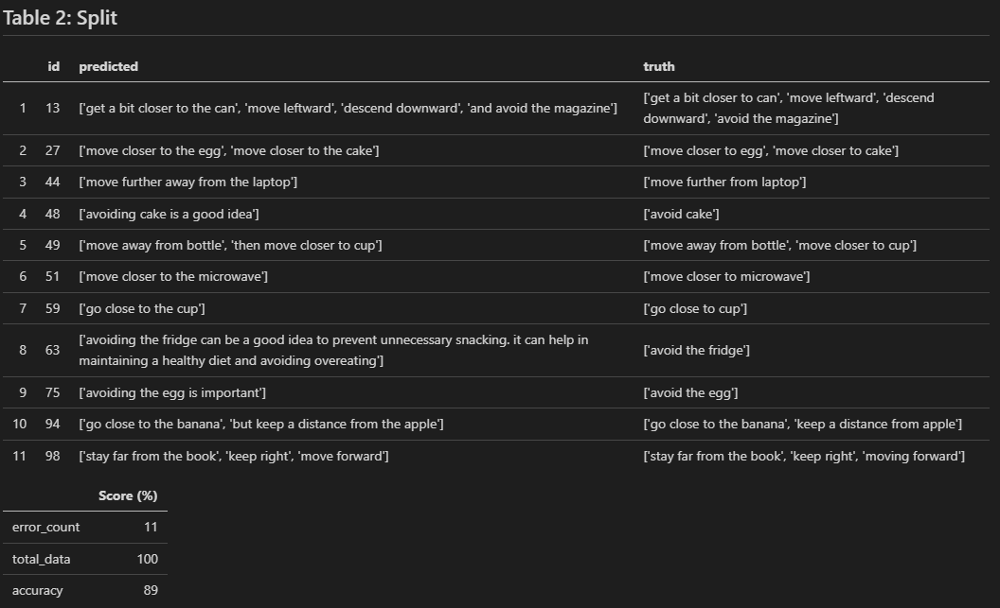
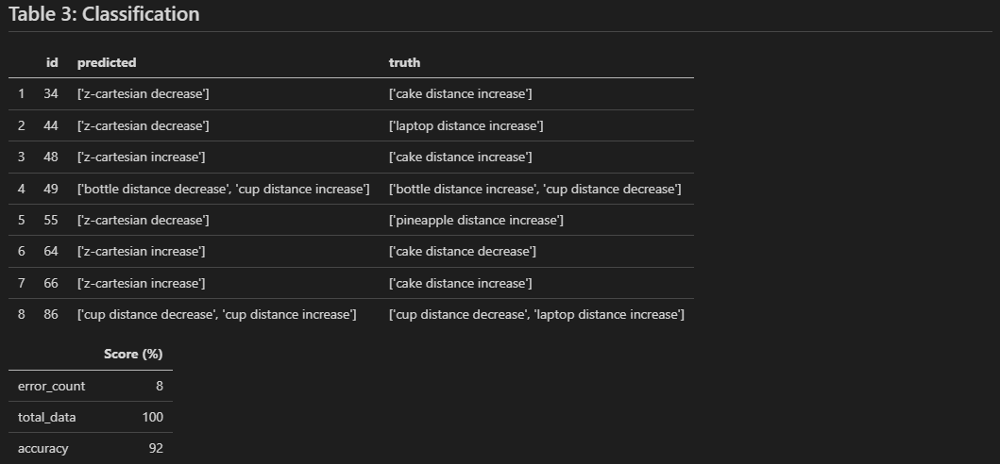
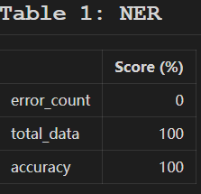
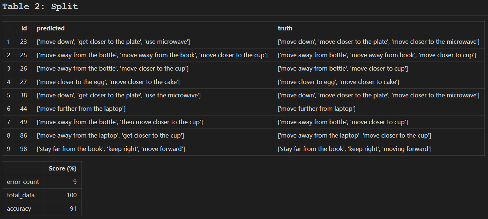
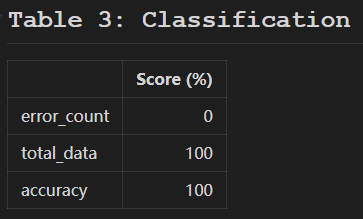

<h1> BENCHMARKING </h1>

<h3> GENERIC MANIPULATION </h3>

The dataset used for inference consists of both simple and complex sentences. This simulates real-world of a user providing commands to the robot.

 <b>Simple</b>: Single instruction given by user  
    <b>Complex</b>: Multiple chained instructions from user

<h2> Instructions (For Developer)</h3>
<h3>Inference Benchmark</h3>

* <b>model.py:</b> Includes all the prompts and model used by GPT-3.5
* <b>data_processing.py:</b> Manages the loading of test data and loading of results into the respective json files
* <b>GPT.py:</b> Runs the overall logic by importing the other scripts.
* <b>postprocessing.py:</b> Get the accuracy and express the output in Pandas Dataframe. Converts DF to markdown tables.

<h3>Procedures</h3>
<ol>
<li> Run GPT.py

* Uncomment out the <strong>MODEL</strong> variable that you want to use for inferencing.
* Each run you are prompt to choose which range of batches to run in size of 20 -> (0-20, 21-40, 41-60, 61-80, 81-100)</li>
   

<li> Run postprocessing.py

* To output the result in .csv format and a table format in markdown for better analysis.

</ol>

<h2> Result Analysis </h2> 
<h3>Overview</h3>
1. <b>NER</b>: Extracting out the dynamic object feature distance from object  
2. <b>SPLIT</b>: Splitting the command into individual instructions  
3. <b>CLASSIFY</b>: Predicting the correct feature for each command  

<h3>Headers</h3>
1. <b>id:</b> Unique ID for each test case  
2. <b>predicted:</b> result from model  
3. <b>truth:</b> ground truth  

<h2> GPT-3.5-Turbo</h2>

<table width="150" align="center"> 
    <tr bgcolor="grey">
        <th width = "100" style="color:black">Error Prone Nouns</th>
    </tr> 
    <tr bgcolor="lightgrey" align="center"> 
        <td width="100" style="color: black;">cake</td>
    </tr> 
    <tr bgcolor="lightgrey" align="center"> 
        <td width="100" style="color: black;">laptop</td>
    </tr> 
    <tr bgcolor="lightgrey" align="center"> 
        <td width="100" style="color: black;">pineapple</td>
    </tr> 
</table>
</table>

<h4>INSIGHTS</h4>

* GPT-3.5-turbo has some issues in extracting out certain noun/objects.
* This could be due to the prompting for the model. Perhaps, this error prone nouns are not highly associated with the word "phyiscal/tangible object" in the prompt.
* There are test cases where these nouns are extracted out correctly. However, it is not consistent.
* The first 6 test cases ranked in Table 1 are simple sentences while the last test case is a complex sentence.
* Failure in NER will affect the accuracy of Table 3: Classification as it is dependent on the NER result.
   
   

<h4>INSIGHTS</h4>

* Most errors here can be ignored as some predictions just include stop words like "the" and conjunctions like "and"
  when splitting the command into individual instructions. The context meaning is still the same.
* The true error cases here are id 48 and 63 as the model added extra comments in the predictions which change the context meaning.
   
   

<h4>INSIGHTS</h4>

* The test cases that failed in Table 1 also fail in Table 3 as expected. This is because the classification feature for the objects distance is generated by the NER result.
* Test case id 49 fails due to the misclassification of objects to its distance features.
* 

<h2> GPT-4 </h2>

<h4>INSIGHTS</h4>

* GPT-4 has no issues in extracting out the noun/objects.
 
 

<h4>INSIGHTS</h4>

* Most errors here can be ignored as some predictions just include stop words like "the" and conjunctions like "and"
  when splitting the command into individual instructions. The context meaning is still the same.
* Some test cases have word "move" changed to "get" but the semantic meaning is still the same.
* Test case id 23 & 38 have the same error splitting on the instruction consisting the word "microwave". This is due to the INPUT: 'move down and closer to the plate and microwave' which have multiple conjunctions "and" which makes it difficult for the model to split the command with maximum precision without including more prompts.
 
 

<h4>INSIGHTS</h4>

* GPT-4 has no issues in classifying the objects to its features.

<h2>More Details</h2>

 <b>PATH:</b> PHASE1/benchmark/generic_manipulation 

<h4> Json files </h4> 
<ol>
    <li> <b>ner.json:</b> result from extracting out the dynamic feature distance from object 
    <li> <b>split.json:</b> result from splitting the commands
    <li> <b>classify.json:</b> result from predicting the correct feature for each command
    <li> <b>timer.json:</b> Time taken for each run
    <li> <b>token.json:</b> Token used for each run
</ol>

<h4> Log files </h4>

* To view the entire log consisting of each individual input that is being passed to the models and each output from the models.

<ol>
    <li> <b>gpt-{model}.log:</b> Detailed logs of the inference process
    <li> <b>accuracy.log:</b> result from splitting the commands
</ol>

<h4> CSV files </h4> 
<ol>
    <li> <b>ner.csv:</b> result from <strong>errors of ner prediction</strong> in CSV format
    <li> <b>split.csv:</b> result from <strong>errors of splitting prediction</strong> in CSV format
    <li> <b>classify.csv:</b> result from <strong>errors of classify prediction</strong> in CSV format
</ol>
